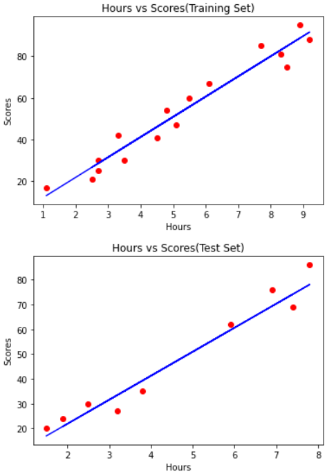

# Implementation-of-Simple-Linear-Regression-Model-for-Predicting-the-Marks-Scored

## AIM:
To write a program to implement the simple linear regression model for predicting the marks scored.

## Equipments Required:
1. Hardware – PCs
2. Anaconda – Python 3.7 Installation / Moodle-Code Runner

## Algorithm
1. Use the standard libraries in python for Gradient Design.
2. Set variables for assigning dataset values.
3. Import linear regression from sklearn.
4. Assign the points for representing in the graph.
5. Predict the regression for marks by using the representation of the graph.
6. Compare the graphs and hence we obtained the linear regression for the given datas.

## Program:
```
'''
Program to implement the simple linear regression model for predicting the marks scored.
Developed by: bhuvaneshwar v
RegisterNumber: 212221240009
'''

import pandas as pd
import matplotlib.pyplot as plt
data=pd.read_csv('scores.csv')
data.head()
X=data.iloc[:,:-1].values
Y=data.iloc[:,1].values
from sklearn.model_selection import train_test_split
X_train,X_test,Y_train,Y_test=train_test_split(X,Y,test_size=1/3,random_state=0)
from sklearn.linear_model import LinearRegression
reg=LinearRegression()
reg.fit(X_train,Y_train)
Y_pred=reg.predict(X_test)
plt.scatter(X_train,Y_train,color='red')
plt.plot(X_train,reg.predict(X_train),color='blue')
plt.title('Hours vs Scores(Training Set)')
plt.xlabel('Hours')
plt.ylabel('Scores')
plt.show()
plt.scatter(X_test,Y_test,color='red')
plt.plot(X_test,reg.predict(X_test),color='blue')
plt.title('Hours vs Scores(Test Set)')
plt.xlabel('Hours')
plt.ylabel('Scores')
plt.show()

```

## Output:



## Result:
Thus the program to implement the simple linear regression model for predicting the marks scored is written and verified using python programming.